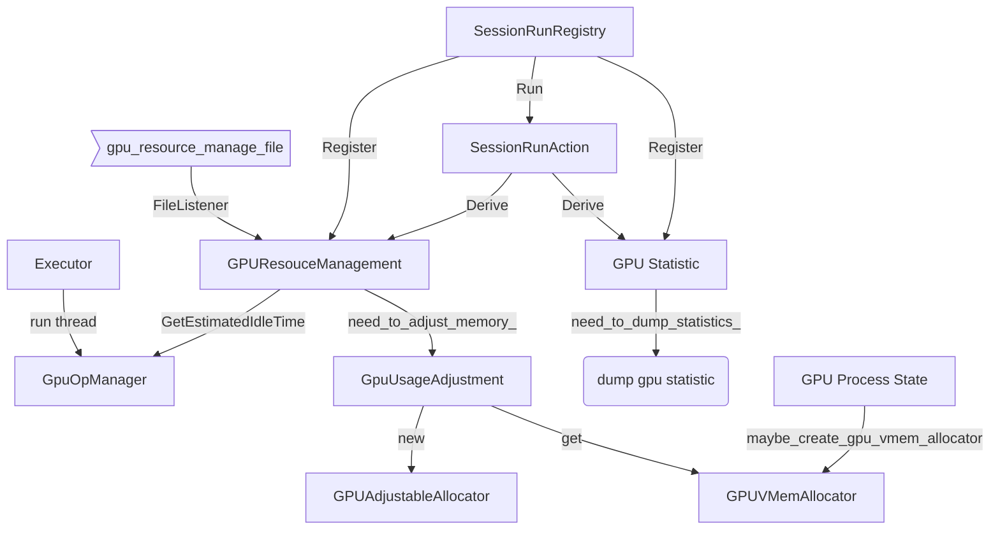
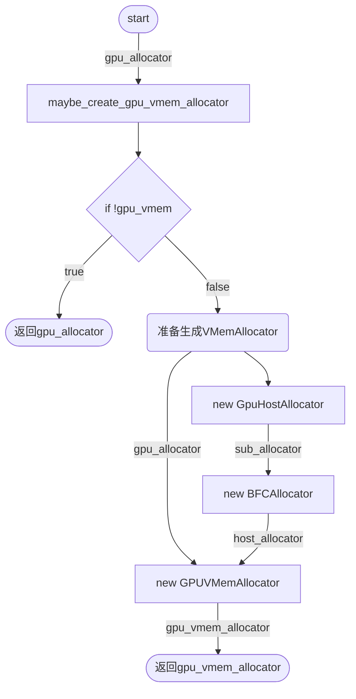

## Antman对Tensorflow的代码修改

总体的关系图，主要包括两个实现， 内存方面的GPUResourceManagement以及算力方面的GpuOpManager。




## GPUVMemAllocator

GPUVMemAllocator 可以分配host的mem作为显存的备用，以免出现OOM错误。

### 创建allocator

maybe_create_gpu_vmem_allocator(...)可以根据情况返回合适的allocator



```c++
Allocator* maybe_create_gpu_vmem_allocator(Allocator* gpu_allocator,
                                           int bus_id,
                                           PlatformGpuId platform_gpu_id,
                                           int tf_gpu_id,
                                           se::StreamExecutor* stream_exec) {
  bool gpu_vmem = false;
  Status status = ReadBoolFromEnvVar("TF_GPU_VMEM",
                                     true/*enabled by default*/,
                                     &gpu_vmem);
  if (!status.ok()) {
    LOG(ERROR) << "GetGPUAllocator: " << status.error_message();
  }
  if (!gpu_vmem) {
    return gpu_allocator;
  }
  SubAllocator* sub_allocator = new GpuHostAllocator(
      GpuIdUtil::ExecutorForPlatformGpuId(platform_gpu_id).ValueOrDie(),
      bus_id, {}, {});
  int64 cuda_host_mem_limit_in_mb = -1;
  status = ReadInt64FromEnvVar("TF_CUDA_HOST_MEM_LIMIT_IN_MB",
                               1LL << 16 /*64GB max by default*/,
                               &cuda_host_mem_limit_in_mb);
  if (!status.ok()) {
    LOG(ERROR) << "GetGpuHostAllocator: " << status.error_message();
  }
  int64 cuda_host_mem_limit = cuda_host_mem_limit_in_mb * (1LL << 20);
  Allocator* host_allocator =
      new BFCAllocator(sub_allocator, cuda_host_mem_limit,
                       true /*allow_growth*/,
                       strings::StrCat("GPUHost_", tf_gpu_id, "_bfc"));
  Allocator* gpu_vmem_allocator = new GPUVMemAllocator(gpu_allocator,
                                                       host_allocator,
                                                       tf_gpu_id,
                                                       stream_exec);
  return gpu_vmem_allocator;
}
```

### 分配虚拟内存

先尝试分配GPU内存， 分配成功则返回， 分配失败则分配CPU内存。

```c++
void* GPUVMemAllocator::AllocateRaw(size_t alignment, size_t num_bytes) {
    mutex_lock l(lock_);
    AllocationAttributes new_attr;
    // Tell the device_allocator_ not to retry
    // since we can alloc host memory as backup
    new_attr.no_retry_on_failure = true;
    void* ret = device_allocator_->AllocateRaw(alignment, num_bytes, new_attr);
    if (ret != nullptr) {
      device_ptrs_.insert(ret);
      return ret;
    }
    ret = host_allocator_->AllocateRaw(alignment, num_bytes);
    VLOG(3) << "host_allocator_ allocates " << (num_bytes/1024.0/1024) << " MiB";
    return ret;
}
```

## SessionRunActionRegistry（中间件框架）

添加了一个SessionRunActionRegistry框架， 方便在session开始之前或者结束之后添加执行动作

### 修改direct_session.cc 和 master_session.cc

/修改了原先的session执行流程 在session执行前后分别执行actions 

``` c++

// Running all pre session run action in grouping
  SessionRunActionOptions action_options;
  action_options.device_mgr = &device_mgr_;
  action_options.sess_ptr = this;
  TF_RETURN_IF_ERROR(SessionRunActionRegistry::Global()->RunGrouping(
      SessionRunActionRegistry::PRE_SESSION_RUN, action_options));
...
    
 const uint64 time_duration_usecs = options_.env->NowMicros() - start_time_usecs;
  metrics::UpdateGraphExecTime(time_duration_usecs);

  // Running all post session run action in grouping
  uint64 session_end_time = tensorflow::Env::Default()->NowMicros();
  action_options.sess_duration_us = time_duration_usecs;
  action_options.graph_id = reinterpret_cast<uint64>(executors_and_keys);
  TF_RETURN_IF_ERROR(SessionRunActionRegistry::Global()->RunGrouping(
      SessionRunActionRegistry::POST_SESSION_RUN, action_options));

```

### 注册action

```cc
void SessionRunActionRegistry::Register(
    Grouping grouping, int phase, SessionRunAction* action) {
  VLOG(2) << "Register session run action " << action->name();
  groups_[grouping][phase].emplace_back(action);
}


// 一些宏函数: 提供注册中间件的接口
#define REGISTER_SESSION_RUN_ACTION(grouping, phase, action) \
  REGISTER_ACTION_UNIQ_HELPER(__COUNTER__, grouping, phase, action)

#define REGISTER_ACTION_UNIQ_HELPER(ctr, grouping, phase, action) \
  REGISTER_ACTION_UNIQ(ctr, grouping, phase, action)

#define REGISTER_ACTION_UNIQ(ctr, grouping, phase, action)             \
  static ::tensorflow::session_run_action_registration::               \
      SessionRunActionRegistration register_session_run_action_##ctr(  \
          grouping, phase, new action(),                               \
          #action)

}  // namespace tensorflow

#endif  // TENSORFLOW_CORE_COMMON_RUNTIME_SESSION_RUN_ACTION_REGISTRY_H_

```

```cc
//定义了一个RunAction()的接口， Action 必须实现这个接口
class SessionRunAction {
 public:
  virtual ~SessionRunAction() {}
  virtual Status RunAction(const SessionRunActionOptions& options) = 0;
  void set_name(const string& name) { name_ = name; }
  std::string name() const { return name_; }

 private:
  // The name of the action, which is the same as the inherited
  // class name.
  string name_;
};
```

## GPU memory limit adjustment

实现动态资源分配， 自动调整现存限制， 当发现 Host 内存被使用的时候，会提高显存的限制阈值，这样所有的 Tensor 都可以申请在显卡上。这样只会影响一个 mini batch 的性能，后面的 mini batch 跑前向后向计算的时候，所有的 Tensor 都会被申请在显存上。

###  修改了tensorflow 原本的 BFC_Allocator.h

增加了friend class GPUAdjustableAllocator;

```cc
  // Declare the GPUAdjustableAllocator to be friend of the BFCAllocator,
  // therefore it can adjust the memory limit by modifying the private
  // member variables of BFCAllocator.
  friend class GPUAdjustableAllocator;
```

### 增加了扩缩显存分配的函数

```cc
class GPUAdjustableAllocator final {
 public:
  // Adjust the memory_limit_ to allow memory grow/shrink at runtime
  // Returns adjusted memory_limit_. If the return value is less than
  // the new_memory_limit, the adjustment failed.
  size_t AdjustMemoryLimit(size_t new_memory_limit,
                           BFCAllocator* bfc_allocator);

  // Get the memory pool size and in used memory size of the bfc_allocator.
  void GetMemPoolStats(BFCAllocator* bfc_allocator,
                      int64_t* deviceMemPoolSize, int64_t* deviceMemStable);

 private:
  // Free the memory regions that are not in use
  size_t FreeEmptyMemory(size_t target_memory_bytes,
                         BFCAllocator* bfc_allocator)
      EXCLUSIVE_LOCKS_REQUIRED(lock_);
};
```

```cc
size_t GPUAdjustableAllocator::AdjustMemoryLimit(size_t new_memory_limit, BFCAllocator* bfc_allocator) {
  mutex_lock l(bfc_allocator->lock_);
  if (new_memory_limit >= bfc_allocator->total_region_allocated_bytes_) {
    // 1) new_memory_limit >= memory_limit_ : grow memory size
    // 2) memory_limit_ > new_memory_limit >= total_region_allocated_bytes_:
    //    shrink, but don't need to free memory
    // In both cases, no action needed by changing the memory limit
    bfc_allocator->memory_limit_ = new_memory_limit;
    bfc_allocator->stats_.bytes_limit = new_memory_limit;
  } else {
    // total_region_allocated_bytes_ > new_memory_limit:
    // shrink, need to free memory
    size_t free_res = FreeEmptyMemory(
        new_memory_limit, bfc_allocator);
    if (free_res <= new_memory_limit) {
      bfc_allocator->memory_limit_ = new_memory_limit;
      bfc_allocator->stats_.bytes_limit = new_memory_limit;

    } else {
      bfc_allocator->memory_limit_ = free_res;
      bfc_allocator->stats_.bytes_limit = free_res;

    }
  }
  return bfc_allocator->memory_limit_;
}
```

## File Listener

监控配置文件是否发生改变， 如果发生改变则触发响应的handler,以及一个回调函数

```cc
void FileListener::RegisterFileListener(const std::string& file_path,
                                        const std::string& handler_name,
                                        callback callback_func) {
  LOG(INFO) << "Register a file listener named " << handler_name
             << " on file " << file_path;
  FileInfo new_file(file_path);
  std::vector<CallbackFunc> new_handlers;
  InfoAndHandlers value = {new_file, new_handlers};
  CallbackFunc new_callback(handler_name, callback_func);

  mutex_lock l(lock_);
  auto res = listeners_.emplace(file_path, value);

  res.first->second.file_handlers_.emplace_back(new_callback);

  if (file_monitor_thread_ == nullptr) {
    // Note we should start only one monitor thread
    StartMonitorThread();
  }
}
```

## GPU resource management（中间件）

继承了SessionRunAction, 是一个资源管理中间件，定义如下

```cc
class GPUResourceManagement : public SessionRunAction {
 public:
  // Note that we will enable TF_FORCE_GPU_ALLOW_GROWTH and TF_GPU_VMEM
  // automatically if the GPUResourceManagement feature is enabled.
  GPUResourceManagement();
  ~GPUResourceManagement() override;
  ...	
  ...    
  //🚨配置文件更新后， 解析新的配置并存放于此
  // For recording the parsed new gpu resource limit.
  //🚨 GPU 资源限制
  std::unordered_map<std::string, GPUResourceLimitInfo>
      gpu_resource_management_info_;

  // For recording the parsed new gpu performance limitation
  // (if the value is 0, then it means to suspend this job).
  // 🚨 GPU 性能限制， 如果值为0， 意味着挂起这个job
  std::atomic<int> gpu_perf_control_;

  // For recording the total time of all inserted time slot.
  uint64 total_time_slot_;

  // For recording the estimated total idle time.
  uint64 estimated_total_idle_time_;

  // For recording the total number of queued GPU op running in
  // the specified executor.
  //  🚨记录每一个Executor要执行的OP数目
  std::unordered_map<const void*, uint64> executor_queued_op_num_;

  // Determine if we need to adjust the GPU usage limit.
  // 🚨表示是否需要更改配置
  std::atomic<bool> need_to_adjust_memory_;

  // For performing the adjustment.
  // 修改配置的类的实例
  GPUUsageAdjustment* gpu_usage_adjustment_;

  const std::string FILE_LISTENER_NAME = "GPUResourceManage";
};

```

### GPUResourceManagement()

```cc
GPUResourceManagement::GPUResourceManagement()
    : need_to_adjust_memory_(false),
    gpu_perf_control_(100),
    gpu_usage_adjustment_(new GPUUsageAdjustment()) {
    //从环境变量中读取gpu配置文件的路径
  ReadStringFromEnvVar("GPU_CONFIG_FILE", "", &gpu_resource_manage_file_path_);
        
  if (gpu_resource_manage_file_path_.empty()) {
    enable_gpu_resource_manage_ = false;
  } else {
    enable_gpu_resource_manage_ = true;
    // Note that we will enable TF_FORCE_GPU_ALLOW_GROWTH and TF_GPU_VMEM
    // automatically if the GPUResourceManagement feature is enabled.
    setenv("TF_FORCE_GPU_ALLOW_GROWTH", "true", 1);
    setenv("TF_GPU_VMEM", "true", 1);

    // Register a handler that will be triggered when the file named
    FileListener::GlobalFileListener()->RegisterFileListener(
        gpu_resource_manage_file_path_, FILE_LISTENER_NAME, //FILE_LISTENER_NAME: "GPUResourceManage"
        [](const std::string& str) {
          // The callback func which is invoked when file changed.
          // 传入一个json文件，包含ManageInfo   
          // 当文件更改时， 获取相应的在session结束后调用顺序为2的action中名为GPUResourceManagement的action
          // action解析新的配置信息
          // 等到session 触发RunAction()， 更新限制
          SessionRunAction* act =
              SessionRunActionRegistry::Global()->GetAction(
                  SessionRunActionRegistry::POST_SESSION_RUN, 2,
                  "GPUResourceManagement");
          if (act == nullptr) {
            std::cout << "Cannot get the instance of GPUResourceManagement \n";
          }
          if (act != nullptr) {
            GPUResourceManagement* rm =
                dynamic_cast<GPUResourceManagement *>(act);
            if (rm != nullptr) {
              rm->ParseManageInfoFromJson(str);
            }
          }
        });
  }
}
```

### 注册中间件

意味着session 结束前后要执行RunAction（...）

```cc
#if GOOGLE_CUDA
// We register the GPUResourceManagement as a POST_SESSION_RUN action
// during the initialization phase of the program.
REGISTER_SESSION_RUN_ACTION(SessionRunActionRegistry::POST_SESSION_RUN,
                            2, GPUResourceManagement);

#endif  // GOOGLE_CUDA 
```

### 实现函数RunAction（...）

如果需要进行显存调整， 则调用GPUUsageAdjustment调整资源

```cc
Status GPUResourceManagement::RunAction(
    const SessionRunActionOptions& options) {
  if (!need_to_adjust_memory_ && gpu_perf_control_ >= 100) {
    // TODO(shiru): do we need to unregister the
    // GPUResourceManagement if the environment variable
    // GPU_CONFIG_FILE is set to null?
    return Status::OK();
  }

  if (need_to_adjust_memory_) {
    mutex_lock l(manage_mu_);
    // Start to adjust the resource limit as required.
    for (const auto& it : gpu_resource_management_info_) {
      gpu_usage_adjustment_->AdjustMemLimit(it.first, //GPU总线id
          it.second.mem_limit_, options.device_mgr,	  //新的显存限制， 设备管理器
          options.device_set);						  //设备集合
    }
    need_to_adjust_memory_ = false;
  }
    
 // 暂停一段时间 或者 挂起这个job
  DoSleepOrSuspend(options.sess_duration_us);

  return Status::OK();
}

```

### GPUUsageAdjustment.cc

```cc
bool GPUUsageAdjustment::AdjustMemLimit(const std::string& gpu_pci_bus_id,
    size_t new_mem_limit,
    const std::unique_ptr<const tensorflow::DeviceMgr>* device_mgr,
    const std::unique_ptr<DeviceSet>* device_set) {
  mutex_lock l(adj_mu_);
	//一个记录对应gpu使用情况的map
  auto cur_info = cur_usage_info_.find(gpu_pci_bus_id);
  if (cur_info == cur_usage_info_.end()) { //如果没有相应的使用信息， 则立刻获取使用信息
    GPUBFCAllocator* allo = GetGPUAllocator(device_mgr,
        device_set, gpu_pci_bus_id);
    if (allo == nullptr) {
      LOG(ERROR) << "Failed to get the allocator of gpu_pci_bus_id: "
                 << gpu_pci_bus_id;
      return false;
    }
    GPUUsageInfo usage_info;
    usage_info.gpu_allocator_ = allo;
    usage_info.cur_limit_.mem_limit_ = ULONG_MAX;
    // Get the VGPU_MEMORY_LIMIT
    absl::optional<AllocatorStats> device_stats = allo->GetStats();
    usage_info.cur_limit_.initial_mem_limit_ = 
      device_stats ? *device_stats->bytes_limit : ULONG_MAX;

    auto ret = cur_usage_info_.emplace(gpu_pci_bus_id, usage_info);
    if (ret.second == false) {
      return false;
    }
    cur_info = ret.first;
  }
	//如果超出虚拟GPU的使用限制， 则使用上限
  if (new_mem_limit > cur_info->second.cur_limit_.initial_mem_limit_) {
    // The new mem size limit exceeds VGPU_MEMORY_LIMIT
    new_mem_limit = cur_info->second.cur_limit_.initial_mem_limit_;
    LOG(WARNING) << "The new mem size limit exceeds VGPU_MEMORY_LIMIT, "
                 << "therefore, adjust the new mem size limit to : "
                 << new_mem_limit;
  }
	//如果在限制范围内，并且需要调整， 且调整后的值不为0， 
    //调用GPUAdjustableAllocator， 更改内存限制， 并且更新使用信息
  if (cur_info->second.cur_limit_.mem_limit_ != new_mem_limit
      && new_mem_limit >= 0) {
    // Adjust the memory limit of this GPU
    LOG(INFO) << "Start to manage the mem size limit to "
              << new_mem_limit
              << " of device gpu_pci_bus_id: "
              << gpu_pci_bus_id;
    GPUAdjustableAllocator* adj = new GPUAdjustableAllocator();
    size_t cur_mem_limit = adj->AdjustMemoryLimit(new_mem_limit,
        cur_info->second.gpu_allocator_);
    cur_info->second.cur_limit_.mem_limit_ = cur_mem_limit;
    if (cur_mem_limit > new_mem_limit) {
      LOG(ERROR) << "Failed to manage the mem size limit to "
                 << new_mem_limit
                 << " of device gpu_pci_bus_id: "
                 << gpu_pci_bus_id;
      // TODO(shiru): need to check is gpu_allocator_ has been changed!
      return false;
    }
    return true;
  }
  return false;
}
```

## Gpu Statistics （中间件）

在session运行结束后执行，执行顺序为1， 判断是否需要导出GPU统计数据

```cc
Status GPUStatistics::RunAction(const SessionRunActionOptions& options) {
  if (!need_to_dump_statistics_) {
    return Status::OK();
  }
  bool huge_change = RecordSessionRunDuration(
      options.graph_id, options.sess_duration_us);

  if (!ShouldCheckGPUStatistics() && !huge_change) {
    return Status::OK();
  }

  {
    // Global lock.
    mutex_lock l(check_mu_);
    bool dur_flag = CheckSessionRunDuration(options.graph_id,
        options.sess_duration_us);
    bool stat_flag = CheckGPUVMemAllocatorStatistics(options.device_mgr,
        options.device_set);
    if (dur_flag || stat_flag) {
      dumpGPUStatistics();
    }

    gpu_statistics_last_write_ = time(0);
  }

  return Status::OK();
}
```

```cc
void GPUStatistics::dumpGPUStatistics() {
  Json::Value dump_json;
  Json::Value gpu_info_json;
  for (const auto& a : allocator_status_lists_) {
    Json::Value device_json;
    device_json["deviceMemUsedMax"] = Json::Int64(a.deviceMemUsedMax);
    device_json["deviceMemUsedMin"] = Json::Int64(a.deviceMemUsedMin);
    device_json["deviceMemPoolSize"] = Json::Int64(a.deviceMemPoolSize);
    device_json["deviceMemStable"] = Json::Int64(a.deviceMemStable);
    device_json["hostMemUsedMax"] = Json::Int64(a.hostMemUsedMax);
    device_json["hostMemUsedMin"] = Json::Int64(a.hostMemUsedMin);
    device_json["hostMemPoolSize"] = Json::Int64(a.hostMemPoolSize);
    device_json["swapReason"] = a.swapReason;
    device_json["deviceMemUsedNvidia"] = Json::Int64(-1);
    gpu_info_json[a.gpu_pci_bus_id] = device_json;
  }
  dump_json["gpuUsageInfo"] = gpu_info_json;

  Json::Value sess_json;
  uint64 max_duration = 0;
  for (const auto& s : sess_run_durations_) {
    uint64 du = s.second.duration_;
    time_t rec = s.second.recording_time_;
    sess_json["graph_" + std::to_string(s.first)] = Json::UInt64(du);
    if (du > max_duration && time(0) - rec < max_record_interval) {
      max_duration = du;
    }
  }
  dump_json["miniBatchDuration"] = Json::UInt64(max_duration);
  dump_json["Durations"] = sess_json;

  Json::StreamWriterBuilder stream_writer;
  std::unique_ptr<Json::StreamWriter> writer(stream_writer.newStreamWriter());
  std::ofstream statistics_file;
  statistics_file.open(gpu_statistics_file_);
  writer->write(dump_json, &statistics_file);
  statistics_file.close();
  // LOG(INFO) << "gpu_statistics_file updated.";
}
```

注册中间件

```cc
#if GOOGLE_CUDA
// We register the GPUStatistics as a POST_SESSION_RUN action
// during the initialization phase of the program.
REGISTER_SESSION_RUN_ACTION(SessionRunActionRegistry::POST_SESSION_RUN,
                            1, GPUStatistics);
#endif  // GOOGLE_CUDA
```


## GpuOpManager

> GpuOpManager continuously profiles the GPU operators execution time and
> simply distributes idle time slots before launching the GPU operators.

在GPUResourceManagement.cc 中实现了set()和get() 对应executor要执行OP数的接口，

在Executor中以一个线程的形式运行， 在ExecutorState::ExecutorState中新增了一个thread成员变量

修改Executor.cc

### 构造函数里，初始化gpu_op_manger_thread

```cc
 // 获取GPUResourceManagement
  GPUResourceManagement* rm = GetGPUResourceManagement();
  if (rm != nullptr) {
    enable_op_management = (rm->GetEstimatedIdleTime() > 0);
  }

  if (enable_op_management && gpu_op_manager_thread_ == nullptr) {
    gpu_op_manager_thread_ =
      new std::thread(&ExecutorState::AsyncGPUOpManager, this);
  }
```

manager负责插入时间槽， 也就是计算好sleep的时间， 释放资源

```cc
// The manager thread which is in charge of inserting the time slot
// before launching each queued async GPU op.
void ExecutorState::AsyncGPUOpManager() {
  uint64 sleep_time_us = 0;
  need_to_insert_idle_time_ = false;
  GPUResourceManagement* rm = GetGPUResourceManagement();
  if (rm == nullptr) {
    return;
  }

  while (!terminate_op_magager_thread_) {
    need_to_insert_idle_time_ = rm->GetEstimatedIdleTime() > 0 ? true : false;

    std::function<void(void)> queued_call_func = nullptr;
     
    // 1）从队列中获取第一个要执行的Op  
    async_gpu_op_queue_lock_.lock();
    if (!async_gpu_op_queue.empty()) {
      queued_call_func = async_gpu_op_queue.front();
    }
    async_gpu_op_queue_lock_.unlock();

    if (queued_call_func != nullptr) {
      //2）调用这个Op
      queued_call_func();
      async_gpu_op_queue_lock_.lock();
      //3）从队列中删除这个op
      if (!async_gpu_op_queue.empty()) {
        async_gpu_op_queue.erase(async_gpu_op_queue.begin());
        // 数目减一
        num_queued_op.fetch_sub(1);
      }
      async_gpu_op_queue_lock_.unlock();

      // Estimate idle time 预测空闲时间
      uint64 idle_time = rm->GetEstimatedIdleTime();
      uint64 queued_op_num = rm->GetExecutorQueuedOpNum(impl_);
      idle_time = queued_op_num > 0 ? (idle_time / queued_op_num) : 0;
      // 等待一个op的 idle_time
      usleep(idle_time);
      // 设置剩余时间
      uint64 remain_time = rm->GetEstimatedIdleTime();
      remain_time = remain_time > idle_time ? (remain_time - idle_time) : 0;
      rm->SetEstimatedIdleTime(remain_time);
    }
    usleep(default_check_interval);
  }
  return;
}
```

### Process 处理过程

```cc
// Process():
      ...      
          
        Device* kernel_device = impl_->params_.device;

        // Only enqueue this op if it is an async GPU op.
		// 1 如果是一个异步Op， 则加入到异步OP队列
        if (need_to_insert_idle_time_ && (kernel_device->name()).find("GPU") != string::npos) {
          // Enqueue this GPU op therefore we can insert a time slot before launching this op.
          // 在启动这个op之前我们可以插入一个时间槽
          sess_op_num++;

          const GraphView& gview_t = impl_->gview_;
          const NodeItem& item_t = *gview_t.node(id);
          AsyncState* state =
              new AsyncState(params, tagged_node, &item_t, first_input, stats);

          auto async_gpu_kernel = [this, state, id, stats, op_kernel, device] {
            AsyncOpKernel* async = state->item->kernel->AsAsync();

            DCHECK(async != nullptr);
            auto done = [this, state]() {
              Device* device = impl_->params_.device;
              NodeExecStatsInterface* stats = state->stats;  // Shorthand
              Entry* first_input = state->first_input;     // Shorthand

              nodestats::SetOpEnd(stats);
              EntryVector outputs;
              Status s = ProcessOutputs(*state->item, &state->ctx, &outputs, stats);
              nodestats::SetMemory(stats, &state->ctx);
              if (vlog_) {
                VLOG(2) << "Async kernel done: " << state->item->node->id()
                        << " step " << step_id_ << " "
                        << SummarizeNode(*state->item->node)
                        << (state->tagged_node.is_dead ? " is dead" : "")
                        << " device: " << device->name();
              }

              // Clears inputs.
              const int num_inputs = state->item->num_inputs;
              for (int i = 0; i < num_inputs; ++i) {
                (first_input + i)->ClearVal();
              }
              FrameState* input_frame = state->tagged_node.input_frame;
              const int64 input_iter = state->tagged_node.input_iter;
              const int id = state->tagged_node.node->id();
              MaybeMarkCompleted(input_frame, input_iter, id);
              TaggedNodeSeq ready;
              if (s.ok()) {
                PropagateOutputs(state->tagged_node, state->item, &outputs, &ready);
              }
              outputs.clear();
              if (s.ok() && impl_->device_record_tensor_accesses_) {
                // Get the list of all tensors accessed during the execution
                TensorReferenceVector accessed;
                state->ctx.retrieve_accessed_tensors(&accessed);
                nodestats::SetReferencedTensors(stats, accessed);
                // callee takes ownership of the vector
                device->ConsumeListOfAccessedTensors(state->ctx.op_device_context(),
                                                    accessed);
              }
              const bool completed =
                  NodeDone(s, state->item->node, ready, stats, nullptr);
              delete state;
              if (completed) ScheduleFinish();
            };
              
            nodestats::SetOpStart(stats);
            {
              profiler::TraceMe activity(
                  [&] {
                    return strings::StrCat(
                        op_kernel->name(), ":", op_kernel->type_string(),
                        "#id=", step_container_ ? step_container_->step_id() : 0,
                        ",device=", device->name(), ",async=true#");
                  },
                  profiler::GetTFTraceMeLevel(op_kernel->IsExpensive()));
              device->ComputeAsync(async, &state->ctx, done);
            }
          };

          // Enqueue this asyn GPU op.
          async_gpu_op_queue_lock_.lock();
          async_gpu_op_queue.emplace_back(async_gpu_kernel); //添加kernel到op队列
          num_queued_op.fetch_add(1); //加一
          async_gpu_op_queue_lock_.unlock();
        } else {
            
          //2 如果不是异步的OP 则不加入
          // Do not enqueue this op.
          AsyncOpKernel* async = item.kernel->AsAsync();
          DCHECK(async != nullptr);
          AsyncState* state =
              new AsyncState(params, tagged_node, &item, first_input, stats);

          auto done = [this, state]() {
            Device* device = impl_->params_.device;
            NodeExecStatsInterface* stats = state->stats;  // Shorthand
            Entry* first_input = state->first_input;       // Shorthand

            nodestats::SetOpEnd(stats);
            EntryVector outputs;
            Status s = ProcessOutputs(*state->item, &state->ctx, &outputs, stats);
            nodestats::SetMemory(stats, &state->ctx);
            if (vlog_) {
              VLOG(2) << "Async kernel done: " << state->item->node->id()
                      << " step " << step_id_ << " "
                      << SummarizeNode(*state->item->node)
                      << (state->tagged_node.is_dead ? " is dead" : "")
                      << " device: " << device->name();
            }

            // Clears inputs.
            const int num_inputs = state->item->num_inputs;
            for (int i = 0; i < num_inputs; ++i) {
              (first_input + i)->ClearVal();
            }
            FrameState* input_frame = state->tagged_node.input_frame;
            const int64 input_iter = state->tagged_node.input_iter;
            const int id = state->tagged_node.node->id();
            MaybeMarkCompleted(input_frame, input_iter, id);
            TaggedNodeSeq ready;
            if (s.ok()) {
              PropagateOutputs(state->tagged_node, state->item, &outputs, &ready);
            }
            outputs.clear();
            if (s.ok() && impl_->device_record_tensor_accesses_) {
              // Get the list of all tensors accessed during the execution
              TensorReferenceVector accessed;
              state->ctx.retrieve_accessed_tensors(&accessed);
              nodestats::SetReferencedTensors(stats, accessed);
              // callee takes ownership of the vector
              device->ConsumeListOfAccessedTensors(state->ctx.op_device_context(),
                                                  accessed);
            }
            const bool completed =
                NodeDone(s, state->item->node, ready, stats, nullptr);
            delete state;
            if (completed) ScheduleFinish();
          };
          nodestats::SetOpStart(stats);
          {
            profiler::TraceMe activity(
                [&] {
                  return strings::StrCat(
                      op_kernel->name(), ":", op_kernel->type_string(),
                      "#id=", step_container_ ? step_container_->step_id() : 0,
                      ",device=", device->name(), ",async=true#");
                },
                profiler::GetTFTraceMeLevel(op_kernel->IsExpensive()));
            device->ComputeAsync(async, &state->ctx, done);
          }
        }
```

### 结束函数

```cc
// Finish():


if (gpu_op_manager_thread_ != nullptr) {
    terminate_op_magager_thread_ = true;
    if (gpu_op_manager_thread_->joinable()) {
      gpu_op_manager_thread_->join();
    }
    delete gpu_op_manager_thread_;
    terminate_op_magager_thread_ = false;
  }
```

## 总结

